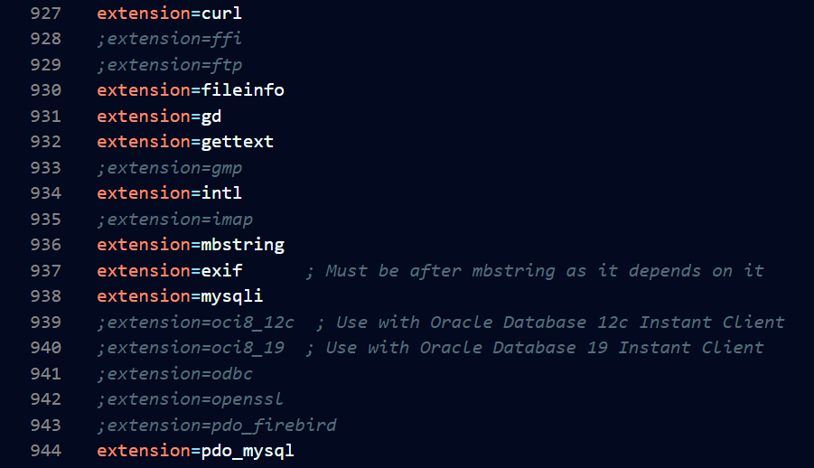
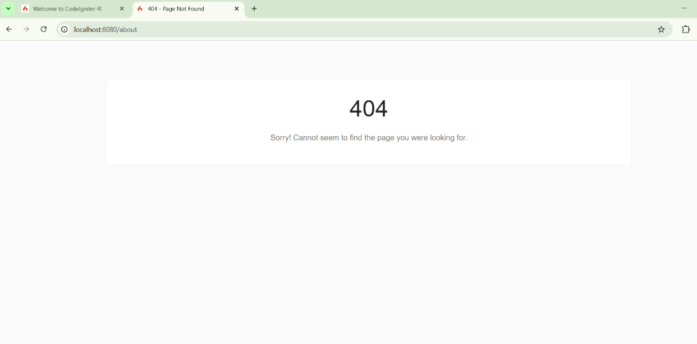
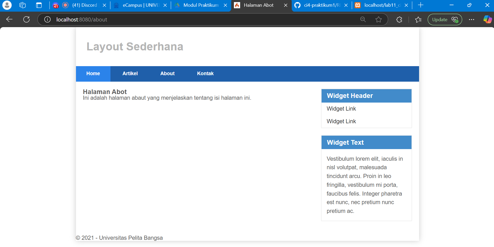
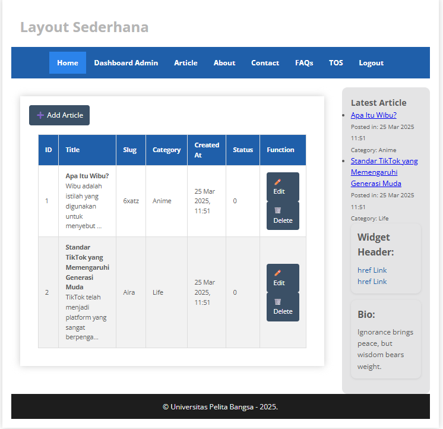
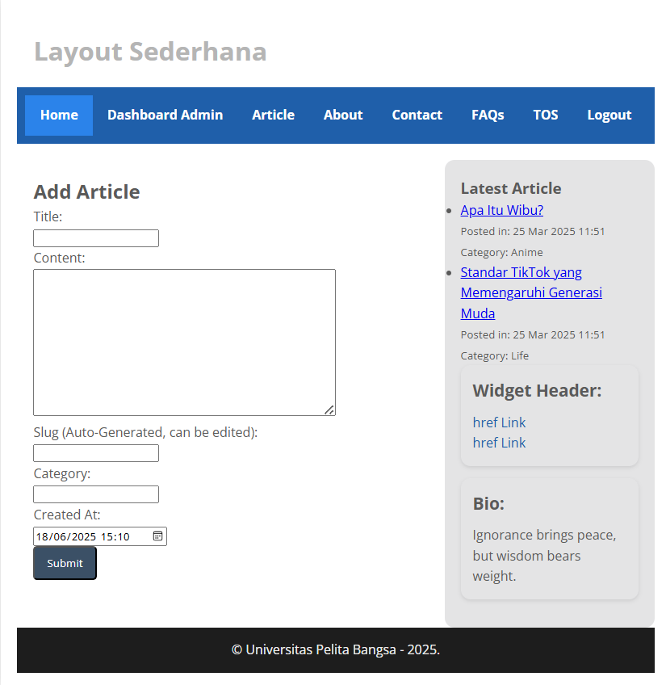

## 👤 Profil Mahasiswa

| Atribut         | Keterangan            |
| --------------- | --------------------- |
| **Nama**        | Daffa Sadewa P         |
| **NIM**         | 312310463         |
| **Kelas**       | TI.23.A.5             |
| **Mata Kuliah** | Pemrograman Website 2 |

# 📌 Tugas Praktikum 4-6

Dokumen ini berisi laporan tugas untuk praktikum 4 hingga 6 dalam mata kuliah Pemrograman Website 2. Setiap praktikum mencakup implementasi lanjutan menggunakan framework CodeIgniter 4.

Dalam praktikum ini, mahasiswa diharapkan memahami konsep autentikasi, pagination, pencarian, serta upload file dalam pengembangan aplikasi web menggunakan CodeIgniter 4. Setiap tahap dijelaskan secara rinci mulai dari pembuatan modul login, implementasi filter akses, pengembangan fitur pagination dan pencarian, hingga upload file gambar.

Laporan ini juga dilengkapi dengan screenshot hasil implementasi untuk mendukung pemahaman serta sebagai bukti keberhasilan dalam menyelesaikan setiap langkah praktikum. Dengan menyelesaikan tugas ini, mahasiswa diharapkan mampu membangun aplikasi berbasis web dengan fitur yang lebih lengkap dan interaktif.

# Praktikum 4: Framework Lanjutan (Modul Login) — Pemrograman Web 2

## 📌 Tujuan Praktikum

1. Memahami konsep dasar autentikasi (Auth) dan filter akses halaman.
2. Mampu membuat modul login sederhana menggunakan CodeIgniter 4.
3. Mengimplementasikan proteksi halaman dengan session dan middleware (filter).
4. Menerapkan fungsi hash password menggunakan `password_hash()` dan `password_verify()`.
5. Membuat login form yang menangani validasi login, flash message, dan redirect user.

---

## 🧰 Tools yang Digunakan

- Visual Studio Code (VSCode)
- XAMPP / Apache + MySQL
- Browser (Chrome / Firefox)
- CodeIgniter 4 (CI4)

---

## 🔧 Langkah-langkah Praktikum

### 1. Persiapan Project

- Pastikan CodeIgniter 4 sudah terpasang dan berjalan dengan baik.
- Jalankan XAMPP dan aktifkan Apache serta MySQL.
- Buka folder `lab7_php_ci` sebagai root project di VSCode.


---

### 2. Membuat Tabel User di Database

Kita butuh tabel user untuk menyimpan data login:

```sql
CREATE TABLE user (
  id INT(11) AUTO_INCREMENT,
  username VARCHAR(200) NOT NULL,
  useremail VARCHAR(200),
  userpassword VARCHAR(200),
  PRIMARY KEY(id)
);
```



---

### 3. Membuat Model `UserModel.php`

File ini berfungsi untuk mengatur query yang berkaitan dengan user.

**Lokasi:** `app/Models/UserModel.php`

```php
namespace App\Models;

use CodeIgniter\Model;

class UserModel extends Model
{
    protected $table = 'user';
    protected $primaryKey = 'id';
    protected $useAutoIncrement = true;
    protected $allowedFields = ['username', 'useremail', 'userpassword'];
}
```


---

### 4. Membuat Controller `User.php`

Controller ini berfungsi untuk mengatur proses login, logout, dan melihat daftar user.

**Lokasi:** `app/Controllers/User.php`

```php
<?php

namespace App\Controllers;

use App\Models\UserModel;

class User extends BaseController
{
    public function index()
    {
        $title = 'Daftar User';
        $model = new UserModel();
        $users = $model->findAll();
        return view('user/index', compact('users', 'title'));
    }
    public function login()
    {
        helper(['form']);
        $email = $this->request->getPost('email');
        $password = $this->request->getPost('password');
        if (!$email) {
            return view('user/login');
        }
        $session = session();
        $model = new UserModel();
        $login = $model->where('useremail', $email)->first();
        if ($login) {
            $pass = $login['userpassword'];
            if (password_verify($password, $pass)) {
                $login_data = [
                    'user_id' => $login['id'],
                    'user_name' => $login['username'],
                    'user_email' => $login['useremail'],
                    'logged_in' => TRUE,
                ];
                $session->set($login_data);
                return redirect('admin/artikel');
            } else {
                $session->setFlashdata("flash_msg", "Password salah.");
                return redirect()->to('/user/login');
            }
        } else {
            $session->setFlashdata("flash_msg", "email tidak terdaftar.");
            return redirect()->to('/user/login');
        }
    }
}

```


---

### 5. Membuat View Login `login.php`

File HTML untuk menampilkan form login.

**Lokasi:** `app/Views/user/login.php`

```html
<!DOCTYPE html>
<html lang="en">
  <head>
    <meta charset="UTF-8" />
    <title>Login</title>
    <link rel="stylesheet" href="<?= base_url('/style.css'); ?>" />
  </head>

  <body>
    <div id="login-wrapper">
      <h1>Sign In</h1>

      <?php if (session()->getFlashdata('flash_msg')): ?>
      <div class="alert alert-danger"><?= session()->getFlashdata('flash_msg') ?></div>
      <?php endif; ?>

      <form action="" method="post">
        <div class="mb-3">
          <label for="InputForEmail" class="form-label">Email address</label>
          <input type="email" name="email" class="form-control" id="InputForEmail" value="<?= set_value('email') ?>" />
        </div>

        <div class="mb-3">
          <label for="InputForPassword" class="form-label">Password</label>
          <input type="password" name="password" class="form-control" id="InputForPassword" />
        </div>

        <button type="submit" class="btn btn-primary">Login</button>
      </form>
    </div>
  </body>
</html>
```


---

### 6. Membuat Seeder `UserSeeder.php`

Seeder digunakan untuk menambahkan data user awal ke dalam tabel.

**Perintah CLI:**

```bash
php spark make:seeder UserSeeder
```

**Isi file `UserSeeder.php`:**

```php
<?php
namespace App\Database\Seeds;
use CodeIgniter\Database\Seeder;
class UserSeeder extends Seeder
{
public function run()
{
$model = model('UserModel');
$model->insert([
'username' => 'admin',
'useremail' => 'admin@email.com',
'userpassword' => password_hash('admin123', PASSWORD_DEFAULT),
]);
}
}
```

**Jalankan Seeder:**

```bash
php spark db:seed UserSeeder
```


---

## Uji Coba Login

- Selanjutnya buka url http://localhost:8080/user/login seperti berikut:


### 7. Menambahkan Auth Filter

Filter digunakan untuk melindungi halaman yang hanya bisa diakses jika user sudah login.

**File:** `app/Filters/Auth.php`

```php
<!DOCTYPE html>
<html lang="en">

<head>
    <meta charset="UTF-8">
    <title>Login</title>
    <link rel="stylesheet" href="<?= base_url('/user.css'); ?>">
</head>

<body>
    <div id="login-wrapper">
        <h1>Sign In</h1>

        <?php if (session()->getFlashdata('flash_msg')): ?>
            <div class="alert alert-danger">
                <?= session()->getFlashdata('flash_msg') ?>
            </div>
        <?php endif; ?>

        <form action="" method="post">
            <div class="mb-3">
                <label for="InputForEmail" class="form-label">Email address</label>
                <input type="email" name="email" class="form-control" id="InputForEmail" value="<?= set_value('email') ?>">
            </div>

            <div class="mb-3">
                <label for="InputForPassword" class="form-label">Password</label>
                <input type="password" name="password" class="form-control" id="InputForPassword">
            </div>

            <button type="submit" class="btn btn-primary">Login</button>
        </form>
    </div>
</body>

</html>
```

**Registrasi Filter di:** `app/Config/Filters.php`

```php
'auth' => \App\Filters\Auth::class
```


---

### 8. Update Routing

Edit `app/Config/Routes.php` untuk menyesuaikan halaman yang dilindungi.

```php
$routes->get('admin/artikel', 'Admin\Artikel::index', ['filter' => 'auth']);
```



---

### 9. Menambahkan Fungsi Logout

Tambahkan method `logout()` pada Controller `User`.

```php
    public function logout()
    {
        session()->destroy();
        return redirect()->to('/user/login');
    }
```



---

## ✅ Uji Coba Aplikasi

1. Buka halaman login: `http://localhost:8080/user/login`
2. Login menggunakan akun dari Seeder:
   - Email: `admin@email.com`
   - Password: `admin123`



3. Jika berhasil, akan redirect ke halaman admin.


4. Coba akses halaman admin tanpa login: akan diarahkan ke login.


---

## 📝 Kesimpulan

- Praktikum ini memberikan pemahaman penting tentang konsep dasar autentikasi dan filter di framework CodeIgniter 4.
- Modul login dapat diimplementasikan dengan pendekatan MVC dan session handler yang rapi.
- Penerapan hashing password dengan `password_hash()` sangat penting untuk keamanan aplikasi.
- Filter sangat berguna untuk membatasi akses ke halaman tertentu agar hanya bisa diakses oleh user yang sudah login.

# Praktikum 5: Pagination dan Pencarian — Pemrograman Web 2

## 📌 Tujuan Praktikum

1. Memahami konsep dasar Pagination (pembagian data menjadi beberapa halaman).
2. Memahami konsep dasar Pencarian (filter data berdasarkan keyword).
3. Mengimplementasikan fitur Paging dan Pencarian pada halaman daftar artikel menggunakan CodeIgniter 4.

---

## 🧰 Tools yang Digunakan

- Visual Studio Code (VSCode)
- XAMPP (Apache + MySQL)
- Browser (Chrome / Firefox)
- Framework CodeIgniter 4

---

## 🔧 Langkah-langkah Praktikum

### 1. Menyiapkan Project

- Jalankan Apache dan MySQL melalui XAMPP.
- Buka folder `lab7_php_ci` di VSCode.
- Pastikan tabel `artikel` sudah memiliki data untuk diuji.

---

### 2. Menambahkan Pagination di Controller

Buka `app/Controllers/Artikel.php`, lalu ubah method `admin_index()`:

```php
public function admin_index() {
    $title = 'Daftar Artikel';
    $model = new ArtikelModel();

    $data = [
        'title'   => $title,
        'artikel' => $model->paginate(10), // Batas 10 artikel per halaman
        'pager'   => $model->pager,
    ];

    return view('artikel/admin_index', $data);
}
```


---

### 3. Menampilkan Pagination di View

Buka file `app/Views/artikel/admin_index.php`, lalu tambahkan ini di bawah tabel:

```php
<?= $pager->links(); ?>
```

Ini akan otomatis menampilkan link navigasi halaman.


---

### 4. Menambahkan Fitur Pencarian

Masih di `admin_index()`, ubah menjadi seperti ini untuk menambahkan filter pencarian:

```php
public function admin_index() {
    $title = 'Daftar Artikel';
    $q = $this->request->getVar('q') ?? '';
    $model = new ArtikelModel();

    $data = [
        'title'   => $title,
        'q'       => $q,
        'artikel' => $model->like('judul', $q)->paginate(10),
        'pager'   => $model->pager,
    ];

    return view('artikel/admin_index', $data);
}
```


---

### 5. Menambahkan Form Pencarian di View

Tambahkan form pencarian sebelum tabel artikel:

```php
<form method="get" class="form-search">
    <input type="text" name="q" value="<?= $q; ?>" placeholder="Cari data">
    <input type="submit" value="Cari" class="btn btn-primary">
</form>
```


---

### 6. Menyesuaikan Link Pagination dengan Query Pencarian

Agar pagination tetap mempertahankan query pencarian (`q`), ubah bagian link pagination menjadi:

```php
<?= $pager->only(['q'])->links(); ?>
```


## 📝 Kesimpulan

- Dengan fitur pagination, tampilan data menjadi lebih ringkas dan mudah dinavigasi.
- Fitur pencarian mempercepat pengguna dalam menemukan data tertentu.
- Implementasi dengan `paginate()` dan `like()` pada CodeIgniter 4 sangat efisien dan simpel.
- Menggabungkan pencarian dan pagination membutuhkan penyesuaian pada controller dan link pagination.

---

Nice! Ini README versi **panjang dan lengkap** untuk **Praktikum 6: Upload File Gambar**. Format udah rapi, siap langsung dijadiin dokumentasi di GitHub. Kamu tinggal tambahin screenshot hasil codingan dan tampilan web-nya aja ya.

---

# Praktikum 6: Upload File Gambar — Pemrograman Web 2

## 📌 Tujuan Praktikum

1. Memahami konsep dasar upload file/gambar pada aplikasi web.
2. Mampu mengimplementasikan fitur upload gambar ke direktori server menggunakan CodeIgniter 4.
3. Mampu menyimpan nama file ke dalam database agar dapat ditampilkan kembali.

---

## 🧰 Tools yang Digunakan

- Visual Studio Code (VSCode)
- XAMPP (Apache + MySQL)
- Browser (Chrome / Firefox)
- Framework CodeIgniter 4

---

## 🔧 Langkah-langkah Praktikum

### 1. Persiapan Project

- Jalankan Apache & MySQL melalui XAMPP.
- Buka folder `lab7_php_ci` di VSCode.
- Pastikan fitur tambah artikel sebelumnya sudah berjalan dengan baik.

---

### 2. Modifikasi Controller: Menambahkan Upload Gambar

Buka file `app/Controllers/Artikel.php`, kemudian ubah method `add()` sebagai berikut:

```php
public function add()
{
    // validasi data
    $validation = \Config\Services::validation();
    $validation->setRules(['judul' => 'required']);

    $isDataValid = $validation->withRequest($this->request)->run();

    if ($isDataValid)
    {
        $file = $this->request->getFile('gambar');
        $file->move(ROOTPATH . 'public/gambar');

        $artikel = new ArtikelModel();
        $artikel->insert([
            'judul'  => $this->request->getPost('judul'),
            'isi'    => $this->request->getPost('isi'),
            'slug'   => url_title($this->request->getPost('judul')),
            'gambar' => $file->getName(),
        ]);

        return redirect('admin/artikel');
    }

    $title = "Tambah Artikel";
    return view('artikel/form_add', compact('title'));
}
```


---

### 3. Modifikasi Form Tambah Artikel

Buka file `app/Views/artikel/form_add.php`, lalu:

#### ✅ Tambahkan Field Input File:

```html
<p>
  <input type="file" name="gambar" />
</p>
```

#### ✅ Ubah Tag Form agar bisa mengunggah file:

```html
<form action="" method="post" enctype="multipart/form-data"></form>
```


---

### 4. Uji Coba Upload Gambar

- Akses halaman `Tambah Artikel` dari dashboard admin.
- Isi judul dan konten artikel, lalu pilih gambar dari komputer.
- Submit form.
  
  

- Jika berhasil, file gambar akan tersimpan di folder `public/gambar/` dan datanya masuk ke database.
  

---

## ✅ Hasil yang Dicapai

- Gambar berhasil diunggah dan disimpan di direktori server (`public/gambar`).
- Nama file berhasil dicatat ke dalam kolom `gambar` di tabel `artikel`.
- Gambar bisa ditampilkan kembali jika dipanggil melalui URL `base_url('gambar/nama_file.jpg')`.

---

## 📝 Kesimpulan

- CodeIgniter 4 menyediakan fitur upload file yang powerful dan mudah digunakan.
- Untuk menerima file dari form, wajib menambahkan atribut `enctype="multipart/form-data"` di form HTML.
- Metode `$this->request->getFile()` digunakan untuk mengambil file dari input.
- Metode `move()` digunakan untuk menyimpan file ke direktori server.
- Selalu simpan nama file ke database untuk ditampilkan kembali.

---
=======
# lab11_ci4
>>>>>>> bbb069a5ddc6847a4b69f5fd54c401e36b226789

